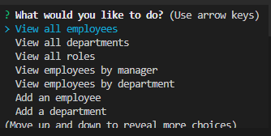
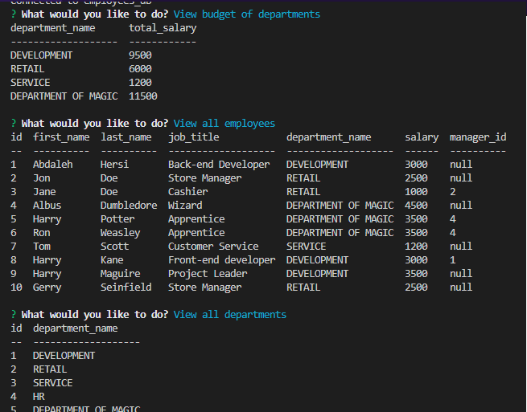

# crowded-octo-structure

# Description

The crowded-octo-structure is a command line content management system that allows you to view and manipulate employee records, department and role tables.

# Links

[My github profile](https://github.com/AbdalehHersi)

[crowded-octo-structure](https://github.com/AbdalehHersi/crowded-octo-structure)

# Installation

Before you can use the program, you must have [Node.js](https://nodejs.org/en/download/), [Inquirer](https://www.npmjs.com/package/inquirer), [console.table](https://www.npmjs.com/package/console.table), [mysql2](https://www.npmjs.com/package/mysql2) package installed. You can download [Node.js](https://nodejs.org/en/download/) from the Node download web page or clicking on [this link](https://radixweb.com/blog/installing-npm-and-nodejs-on-windows-and-mac) for a more in-depth guide. 

Clone the repository code to a location of your choice using the command-line interface of your choice. Once you have done that, use `npm i` or `npm install` command-line interface on the same root level as the `package.json`. After that you should be good to go.

# Usage

To run the program all you need to do is enter `node server.js` You will be presented with a menu where you can choose from a variety of options. 





For a more in depth guide you can view this walkthrough.

[Video](https://drive.google.com/file/d/1aNlCUJGvRuVX6sXgeQ2i_Y8z7gnVfnhN/view)

[Backup Video](https://youtu.be/NUduR6wF8DM)

# Challenge Acceptance Criteria
```
GIVEN a command-line application that accepts user input
WHEN I start the application
THEN I am presented with the following options: view all departments, view all roles, view all employees, add a department, add a role, add an employee, and update an employee role
WHEN I choose to view all departments
THEN I am presented with a formatted table showing department names and department ids
WHEN I choose to view all roles
THEN I am presented with the job title, role id, the department that role belongs to, and the salary for that role
WHEN I choose to view all employees
THEN I am presented with a formatted table showing employee data, including employee ids, first names, last names, job titles, departments, salaries, and managers that the employees report to
WHEN I choose to add a department
THEN I am prompted to enter the name of the department and that department is added to the database
WHEN I choose to add a role
THEN I am prompted to enter the name, salary, and department for the role and that role is added to the database
WHEN I choose to add an employee
THEN I am prompted to enter the employee’s first name, last name, role, and manager, and that employee is added to the database
WHEN I choose to update an employee role
THEN I am prompted to select an employee to update and their new role and this information is updated in the database
```
